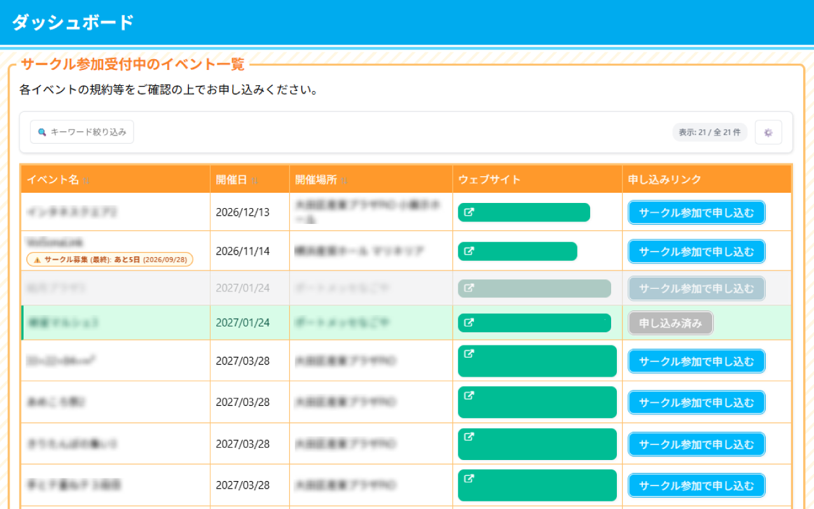
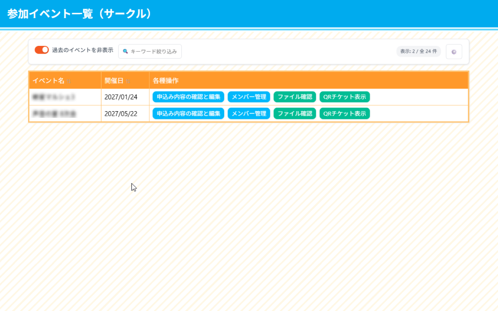
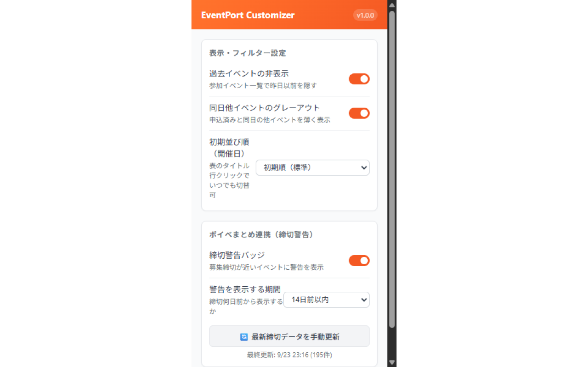

# EventPort UI Customizer

  
   
  <strong>EventPort（イベントポート）の一覧画面をより見やすく、快適にするChrome拡張機能</strong>

  
  
  
  

---

## お知らせ

現在 **Chrome ウェブストアに申請中（審査待ち）** です。  
審査が通過しストアで公開されるまでの間は、下記の手順で **プレビュー版（ZIPファイル）** を手動インストールしてお使いいただけます。

---

## 主な機能

### 1. トップページ（サークル参加受付中一覧）の視覚的アシスト

  

- **申込済みイベントの強調**: すでに申し込み済みのイベント行をグリーン色で分かりやすくハイライトします。
- **同日開催イベントの自動グレーアウト**: 申し込んだイベントと同日に開催される他イベントを薄く表示し、スケジュールの重複や誤申込を防ぎます。
- **「ボイベまとめ」連携・締切警告バッジ**: [ボイベまとめ](https://vo.nrsy.jp/) 様の公開データと正式許諾のもと連携！募集締切や申込変更締切が近づいているイベントに「あと〇日」の警告バッジを表示します。
- **ヘッダークリックソート & 検索**: イベント名・開催日・開催場所の見出しクリックで昇順・降順に並び替え可能。インライン検索ボックスでリアルタイム絞り込みも行えます。

---

### 2. 参加イベント一覧（サークル・メンバー・一般）の過去日整理

  

- **過去イベントのワンクリック非表示**: 昨日以前に終了した過去イベントを非表示にし、直近の参加予定イベントだけをすっきり確認できます（ツールバーのスイッチでいつでも切替可能）。
- **複数項目ソート**: イベント名、開催日、参加サークル名（メンバー一覧時）などのクリックソートに対応。
- **キーワード検索**: 表の上部に設置された検索ボックスで、参加イベントを素早く探せます。

---

### 3. ポップアップからの柔軟な設定カスタマイズ

  

- ツールバー右上の拡張機能アイコンから、いつでも以下の設定を変更できます：
  - 過去イベント非表示のデフォルト ON/OFF
  - 同日他イベントのグレーアウトの有効／無効
  - 開催日の初期並び順（標準 / 昇順 / 降順）
  - 締切警告バッジの表示／非表示および警告期間（3日前 / 7日前 / 14日前など）
  - 最新締切データの手動更新

---

### 4. 厳格なURL制限による高い安全性

意図しない誤動作を防ぐため、指定された以下の4画面でのみ厳格に動作します。申込フォーム入力画面やチケット詳細、決済画面などではスクリプトが一切実行されません。

| ページ名 | 対象URL | 主な機能 |
| :--- | :--- | :--- |
| **受付中イベント一覧（トップ）** | `https://event-port.com/dashboard` | ソート、申込強調、同日グレーアウト、締切警告 |
| **参加イベント一覧（サークル）** | `https://event-port.com/circle-participation` | ソート、過去非表示、検索 |
| **参加イベント一覧（メンバー）** | `https://event-port.com/seller-participation` | ソート（サークル名含む）、過去非表示、検索 |
| **参加イベント一覧（一般）** | `https://event-port.com/general-participation` | ソート、過去非表示、検索 |

---

## プレビュー版のインストール手順（手動導入）

Chrome ウェブストアの公開までの間、以下の手順ですぐにお使いいただけます（所要時間：約1分）。

### ステップ 1: ZIPファイルのダウンロード

1. [GitHub Releases](https://github.com/himajin0816/EventPort-UI-Customizer/releases) から最新のプレビュー版 ZIP ファイル（`EventPort_Customizer_v1.0.0.zip`）をダウンロードします。
2. ダウンロードした ZIP ファイルを任意のフォルダに **展開（解凍）** します。

### ステップ 2: Chrome への読み込み

1. Google Chrome を開き、アドレスバーに `chrome://extensions` と入力して開きます（または右上のメニュー `⋮` >「拡張機能」>「拡張機能を管理」）。
2. 画面右上にある **「デベロッパー モード」** のスイッチを **ON** にします。
3. 画面左上に表示される **「パッケージ化されていない拡張機能を読み込む」** をクリックします。
4. 先ほど解凍したフォルダ（`manifest.json` が入っているフォルダ）を選択します。
5. 一覧に **「EventPort UI Customizer」** が表示されればインストール完了です！🎉

EventPort（<https://event-port.com/dashboard> 等）を開くと、自動的にカスタム機能が有効化されます。

---

## プライバシーポリシー

当拡張機能は、ユーザーの個人情報（氏名、アカウント情報、決済情報、申込データ等）を収集・外部送信することは一切ありません。  
詳細なプライバシーポリシーは以下をご確認ください：  
[プライバシーポリシー (https://github.hmzn.cloud/EventPort-UI-Customizer/)](https://github.hmzn.cloud/EventPort-UI-Customizer/)

---

## 謝辞・データ連携

- 本拡張機能の締切警告機能は、音声合成系イベント開催情報まとめサイト「[ボイベまとめ](https://vo.nrsy.jp/)」管理者様より正式にデータ利用の許諾をいただき実装しております。貴重な情報をご提供いただき、心より感謝申し上げます。
- ※本拡張機能は有志による非公式のファンメイドツールであり、EventPort公式様とは関係ありません。

## ✨あかりちゃん✨

関係ありませんが[紲星あかりちゃん](https://vocalomakets.com/gallery-akari)をよろしくお願いします。

---

## ライセンス

[MIT License](LICENSE)
